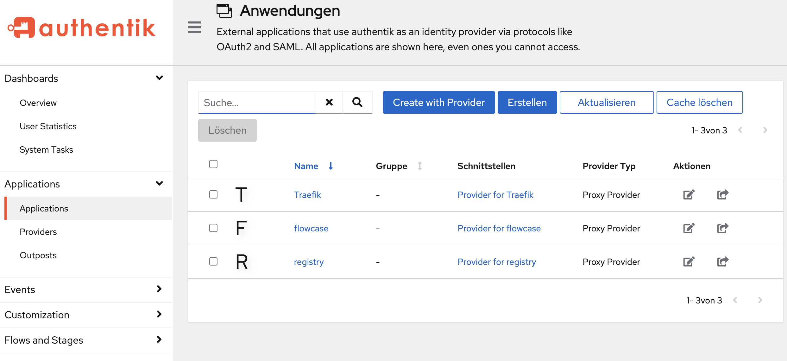

# <div align="center">🌊 **Flowcase with Enterprise Enhancements**</div>

<div align="center">


**Enhanced container streaming platform with external identity provider support**

</div>

> [!CAUTION]
> This project is still in development and is not yet ready for production use. We do not currently support upgrading from older versions. Please use with caution.

## About This Fork

This is an enhanced fork of [flowcase/flowcase](https://github.com/flowcase/flowcase) extending the original with enterprise-grade authentication and access control features.
All improvements are contributed back to the original project via pull requests.

> [!IMPORTANT]
> **Enhanced features are available on the `integration` branch.** The `main` branch tracks the upstream repository. To experience the full enhanced functionality, ensure you're using the `integration` branch.

## What is Flowcase?

**Flowcase** is a free and completely open-source alternative to Kasm Workspaces, enabling secure container streaming for your applications. 

## Features

<div align="center">

| Open-Source | Secure Streaming | User-Friendly | Customizable | Multi-Platform |
|:-------------:|:------------------:|:----------------:|:--------------:|:--------------:|
| Completely free and community-driven | Stream applications securely using Docker | Easy to deploy and manage | Supports customization for various use cases | Supports Windows, Linux, and macOS |

</div>

### Enhanced Features (this fork)

<div align="center">

| External Identity | Advanced Access Control | Container Persistence | Network Flexibility | Registry Management |
|:----------------:|:----------------------:|:--------------------:|:-------------------:|:------------------:|
| Traefik + Authentik integration | Group-based droplet access | Containers survive restarts | Custom Docker network support | Registry URL locking |

</div>

- **🔐 External Identity Provider**: Full integration with Authentik via Traefik forward authentication
- **👥 Group-Based Access Control**: Enhanced user and group management with granular permissions
- **📦 Container Persistence**: Containers persist across application restarts
- **🌐 Network Selection**: Support for custom Docker networks (lan*, vlan*, default)
- **📋 Registry Management**: Registry URL locking and enhanced configuration options to prevent untrusted registries
- **💾 Profile Volume Management**: Improved user profile and volume handling

## Prerequisites

Before getting started, ensure you have:

- Docker and Docker Compose installed on your machine
- A user with sudo/root access or a user in the `docker` group
- Basic knowledge of container management

## Setup Instructions

| Option | Description | Authentication | SSL/HTTPS | Use Case |
|--------|-------------|----------------|-----------|----------|
| **Option 1** | Docker Stack with Traefik + Authentik | External Identity Provider | Yes (automatic) | Production deployment |
| **Option 2** | Docker Stack (Standalone) | Built-in users | No (HTTP only) | Simple deployment, experience new UI features |
| **Option 3** | Direct Command Line | Built-in or simulated | No | UI Development/Debug |

Choose one of the following deployment options:

### Option 1: Docker Stack with Traefik + Authentik (Full Stack)

#### 1. Clone the repository

```shell
git clone https://github.com/rroellig/flowcase.git
cd flowcase
git checkout integration
```

#### 2. Configure environment variables

```shell
cp .env.example .env
# Edit .env with your domain and authentication settings
```

#### 3. Prepare DNS

Create a DNS entry that points to your server:

- The DNS name needs to match your `DOMAIN` setting in `.env`
- Ideally create a wildcard entry (e.g., `*.example.com`) to resolve all services
- Traefik will handle routing to the appropriate service by name and manage SSL certificates automatically

#### 4. Build the Flowcase image

```shell
docker compose build
```

#### 5. Launch the full stack

```shell
docker compose up -d
```

#### 6. Configure Authentik

After the services are running, configure Authentik properly:

**Initial Setup**: Navigate to `https://authentik.<DOMAIN>/if/flow/initial-setup/` to complete the initial Authentik configuration.

1. **Create Proxy Providers** (forward auth, single application) for the following applications:
   - `flowcase` (required)
   - `traefik` (optional, for dashboard access)
   - `registry` (optional, for private registry access)

   

2. **Configure Outposts** - Don't forget to set up outposts for the proxy providers

3. **Set up Users** - Create users in Authentik using either:
   - Local user accounts
   - Federated users/social login integration

> [!NOTE]
> Refer to the [Authentik documentation](https://docs.goauthentik.io) for detailed proxy provider configuration instructions.

#### 7. Access the services

- Flowcase: `https://flowcase.<DOMAIN>`
- Authentik: `https://authentik.<DOMAIN>`
- Traefik Dashboard: `https://traefik.<DOMAIN>`

### Option 2: Docker Stack without Traefik + Authentik (Standalone, http only)

#### 1. Clone the repository

```shell
git clone https://github.com/rroellig/flowcase.git
cd flowcase
git checkout integration
```

#### 2. Build the Flowcase image

```shell
docker compose -f docker-compose.dev.yml build
```

#### 3. Launch with Docker Compose

```shell
docker compose -f docker-compose.dev.yml up
```

> [!NOTE]
> Default admin and user logins will be displayed in the terminal output on initial startup

#### 4. Access Flowcase

Open your browser and navigate to:

```
http://localhost:80
```

### Option 3: Direct Command Line (Development/Debug)

#### 1. Clone the repository

```shell
git clone https://github.com/rroellig/flowcase.git
cd flowcase
git checkout integration
```

#### 2. Optional: Clean data directory

```shell
rm -rf data
```

#### 3. Set up Python environment

```shell
python -m venv venv
source ./venv/bin/activate
pip install -r requirements.txt
```

#### 4. Run Flowcase

```shell
python run.py --port 5001
```

#### 5. Access Flowcase

Open your browser and navigate to:

```
http://localhost:5001
```

## Configuration Options

The application supports several command line configuration options via `run.py`. Arguments are classified into production and development categories:

### Production Arguments

These arguments are intended for production deployments, typically configured in Docker Compose:

- `--traefik-authentik`: Enable Traefik + Authentik integration mode (reads username from X-Authentik-Username header)
- `--registry-lock <registry-name>`: Name of a fixed registry to lock registry edit in the frontend

### Debug/Development Arguments

These arguments are primarily for local development without Docker:

- `--port <port>`: Port to run the application on
- `--ext-idp-user <username>`: Simulate external IDP provider with specified username (bypass sign in, create username if not yet existing)

### Docker Compose Configuration

In `docker-compose.yml`, modify the web service command:

```yaml
services:
  web:
    # ... other configuration
    command: python run.py --traefik-authentik --registry-lock my-registry
```

### Debug Usage Examples

```shell
# Development: Simulate external user for testing
python run.py --ext-idp-user testuser

# Development: Run on custom port
python run.py --port 8080
```

## Branch Information

This repository was forked from commit [`a59084d`](https://github.com/flowcase/flowcase/commit/a59084d) on main. All feature branches can be merged conflict-free back to this starting point:

- **main**: Upstream main branch
- **integration**: All enhanced features combined
- **feature/network-selection**: Docker network dropdown selection for container deployment  
- **feature/container-persistence**: Makes containers survive application restarts
- **feature/improved-access-control**: Group-based access control and user management enhancements
- **feature/reverse-proxy**: Traefik and Authentik integration for external identity providers
- **feature/registry-lock**: Registry URL locking and configuration management
- **feature/image-download-logs-fix**: Enhanced logging and error handling for image downloads
- **feature/profile-volumes**: Improved user profile volume management and handling

## Contributing

Contributions are welcome! This fork contributes improvements back to the upstream project via pull requests.

For upstream contributions: [flowcase/flowcase](https://github.com/flowcase/flowcase)

## Security

Please refer to [SECURITY.md](SECURITY.md) for more information.

---

Enhanced fork by rroellig | Original project by the Flowcase Team
